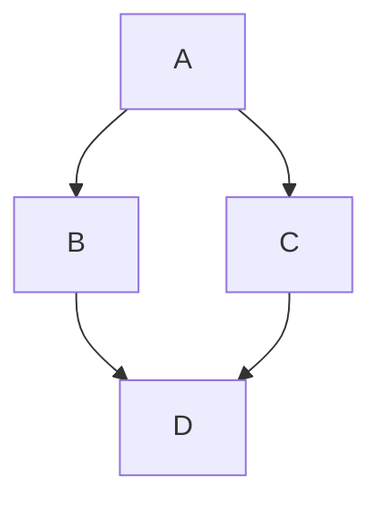

[](https://github.com/ahosking)
[](https://github.com/ahosking)
[](https://github.com/ahosking)

# Don't forget about [mermaid](https://github.blog/2022-02-14-include-diagrams-markdown-files-mermaid/)!


-------

📊 **Weekly development breakdown**

<!--START_SECTION:waka-->

```txt
HTML       15 mins               ██████████████████▓░░░░░░   74.91 %
Markdown   2 mins                ██▓░░░░░░░░░░░░░░░░░░░░░░   10.89 %
YAML       1 min                 █▓░░░░░░░░░░░░░░░░░░░░░░░   06.83 %
JSON       1 min                 █▓░░░░░░░░░░░░░░░░░░░░░░░   06.52 %
Bash       0 secs                ▒░░░░░░░░░░░░░░░░░░░░░░░░   00.85 %
```

<!--END_SECTION:waka-->
