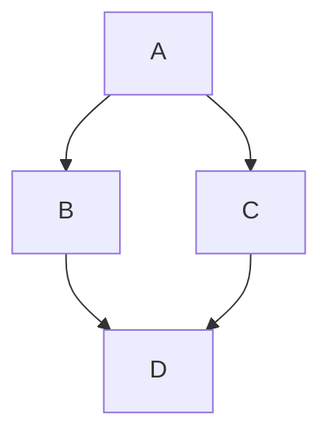

[](https://github.com/ahosking)
[](https://github.com/ahosking)
[](https://github.com/ahosking)

# Don't forget about [mermaid](https://github.blog/2022-02-14-include-diagrams-markdown-files-mermaid/)!


-------

📊 **Weekly development breakdown**

<!--START_SECTION:waka-->

```txt
HTML         29 mins               ██████████▓░░░░░░░░░░░░░░   42.41 %
Dart         19 mins               ███████░░░░░░░░░░░░░░░░░░   27.82 %
JavaScript   13 mins               ████▓░░░░░░░░░░░░░░░░░░░░   19.03 %
Gherkin      3 mins                █▒░░░░░░░░░░░░░░░░░░░░░░░   05.03 %
Markdown     2 mins                █░░░░░░░░░░░░░░░░░░░░░░░░   03.35 %
```

<!--END_SECTION:waka-->
