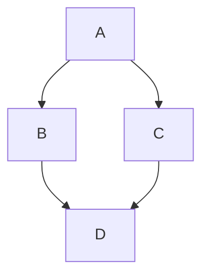

[](https://github.com/ahosking)
[](https://github.com/ahosking)
[](https://github.com/ahosking)

# Don't forget about [mermaid](https://github.blog/2022-02-14-include-diagrams-markdown-files-mermaid/)!


```mermaid
  graph TD;
      A-->B;
      A-->C;
      B-->D;
      C-->D;
```
-------

📊 **Weekly development breakdown**

<!--START_SECTION:waka-->

```txt
Dart         4 hrs 26 mins         ████████████░░░░░░░░░░░░░   48.47 %
Other        2 hrs 36 mins         ███████░░░░░░░░░░░░░░░░░░   28.45 %
Markdown     1 hr 4 mins           ███░░░░░░░░░░░░░░░░░░░░░░   11.68 %
Gherkin      24 mins               █░░░░░░░░░░░░░░░░░░░░░░░░   04.38 %
YAML         14 mins               ▓░░░░░░░░░░░░░░░░░░░░░░░░   02.61 %
```

<!--END_SECTION:waka-->
